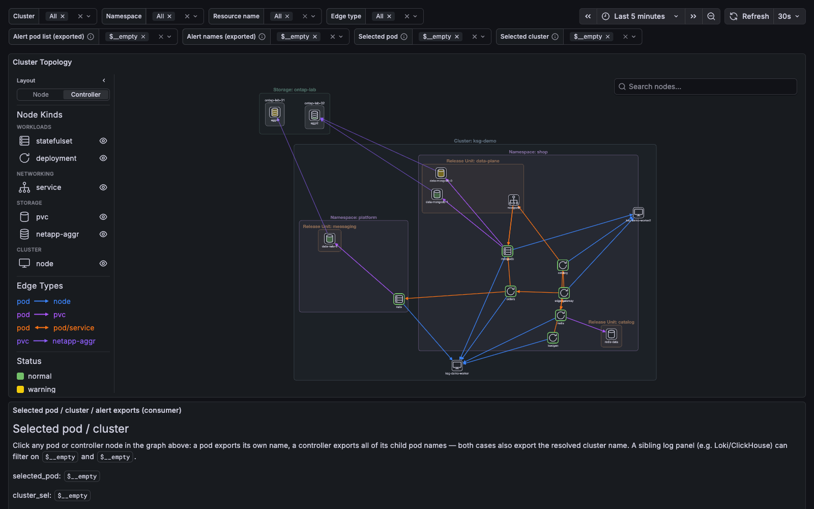

# kube-state-graph-demo

A complete, self-drawing demo of [`kube-state-graph`](https://github.com/akira-core/kube-state-graph)
and [`kube-state-graph-panel`](https://github.com/akira-core/kube-state-graph-panel)
on a local **kind** cluster.

One `make up` builds both projects from source, stands up the whole metrics
pipeline behind them, deploys a synthetic microservice estate that calls itself,
and hands you a Grafana dashboard drawing that estate as an interactive graph.



```bash
make up          # ~5 minutes on a cold laptop
open http://localhost:3001      # Grafana → dashboard "KSG Demo"
```

Then:

```bash
make verify      # walk every hop of the pipeline and say which one is empty
make status      # pods across all three demo namespaces
make graph       # the raw /v1/graph JSON
make down        # delete the cluster
```

## What is real and what is not

kube-state-graph does not read the Kubernetes API. It builds the entire graph
from PromQL over a `[start, end]` window, which means a demo has to produce
*metrics*, not objects. Almost all of them here are produced by real components
doing real work:

| Real | Faked |
|---|---|
| Pods, Services, EndpointSlices, PVCs — actual Kubernetes objects on a 3-node kind cluster | The **NetApp ONTAP array**: aggregates, controllers, FlexVol topology and QoS I/O |
| kube-state-metrics, scraped for the topology series the graph reads | |
| Real kubelet volume stats for claims on `netapp-nas` (CSI NFS `NodeGetVolumeStats`) | |
| Real HTTP calls between workloads, traced with OpenTelemetry | |
| The service-graph metrics, derived from those traces by the collector | |

There is exactly one component whose data is invented — `netapp-faker` — because
a laptop cannot run an ONTAP array. Even that one **discovers rather than
fixtures**: every tick it asks VictoriaMetrics which claims exist on the demo
StorageClass and renders a storage chain behind the `pvc-<uuid>` PV names
Kubernetes actually assigned. Create a PVC and its aggregate, controller and I/O
appear within one tick.

## The pipeline

```
 shop / platform namespaces          monitoring namespace
┌──────────────────────────┐   ┌───────────────────────────────────────────────┐
│ loadgen                  │   │                                               │
│   └→ edge-gateway ─┬→ catalog ──→ redis      OTLP traces                     │
│                    └→ orders ──┬→ mongodb        │                           │
│                                └→ nats           ▼                           │
│                                          ┌───────────────┐                   │
│  kube-state-metrics ────── scrape ──────▶│ OTel Collector│                   │
│  kubelet          ──────── scrape ──────▶│               │                   │
└──────────────────────────┘               │  servicegraph │                   │
                                           │  connector    │                   │
   netapp-faker ──── import ──┐            │  + cluster/az │                   │
                              ▼            │    /env stamp │                   │
                        ┌──────────────────┴───────────────┐                   │
                        │      VictoriaMetrics (cluster)   │                   │
                        │  vminsert → vmstorage → vmselect │                   │
                        └──────────────┬───────────────────┘                   │
                                       │ PromQL                                │
                              ┌────────▼─────────┐                             │
                              │ kube-state-graph │                             │
                              └────────┬─────────┘                             │
                                       │ /v1/graph (Cytoscape JSON)            │
                              ┌────────▼─────────┐                             │
                              │ Grafana + Infinity datasource + KSG panel      │
                              └────────────────────────────────────────────────┘
```

### Why the OpenTelemetry Collector is load-bearing

It does three jobs no other component can:

1. **Scrapes** kube-state-metrics and the kubelets into VictoriaMetrics.
2. **Turns traces into service-graph metrics.** Its `servicegraph` connector
   pairs each CLIENT span with the SERVER span it caused and emits
   `traces_service_graph_request_*` carrying `client_k8s_pod_uid` /
   `server_k8s_pod_uid` — the only thing that lets the backend resolve a call
   edge to a *pod* rather than to an anonymous `external` node. The pod UID
   reaches the span via the downward API (`OTEL_RESOURCE_ATTRIBUTES`).
3. **Stamps `cluster`, `az` and `env`.** kube-state-metrics emits none of
   these, yet every graph id is cluster-scoped and the `?az=` / `?env=` request
   filters are pushed to upstream PromQL as raw label matchers. A family missing
   them does not error — it silently matches nothing.

### Every edge type the backend can produce

The demo is arranged so that all six appear:

| Edge | Produced by |
|---|---|
| `pod-to-node` | every scheduled pod |
| `pod-mounts-pvc` | `mongodb`, `nats`, `redis` |
| `pod-calls-pod` | the HTTP call chain, with RED metrics |
| `pod-calls-service` | `catalog`'s connection-string peer (see below) |
| `service-selects-pod` | the fan-out from that Service to `mongodb-0/1` |
| `pvc-to-netapp-aggr` | the faked ONTAP estate |

`pod-calls-service` needs explaining, because it is not what you would guess.
Service nodes are materialised **on demand**, only for a Service some endpoint
actually named as a `://` connection string. So `catalog` emits a client span
with no server span and `peer.service =
mongodb://mongodb.shop.svc.cluster.local:27017`; the collector turns an
unmatched client span into a *virtual node* labelled with that attribute, and
the backend parses the host, classifies it as Kubernetes `.svc` DNS, and
resolves it to the real `mongodb` Service. `orders` still calls the mongodb
*pods* over HTTP, so the demo shows both shapes reaching the same backend.

### Deliberate negative cases

A demo where everything is green teaches nothing. These are on purpose:

- **`redis-data` is on the default StorageClass**, not `netapp-nas`. It gets a
  PVC node and no storage chain — which is how an operator tells "never meant to
  have a NetApp backend" apart from "should have joined and did not". The
  backend logs one `netapp_volume_join_miss` for it every build; that warning is
  the demo working, not failing.
- **`orders` answers 5% of requests with a 500**, so its edges carry a non-zero
  `errorRate`. An edge with `errorRate: 0` and an edge with no measurement at
  all must look different in the panel.
- **`ontap-lab-02` reports `node_new_status 0`.** Degraded is a real reading,
  distinct from the series being absent.
- **`mongodb`'s Service is headless**, so its `cluster_ip` is `None` and it
  carries no ipaddress — again distinct from an unknown one.
- **Shared NFS export capacity.** `csi-driver-nfs` reports `statfs` of the
  in-cluster Ganesha export, so every claim on `netapp-nas` shows that
  export's size as `capacity_bytes`, not the claim's request. The demo
  proves the kubelet series exist and join; numeric per-claim fidelity is
  not what it demonstrates.

## Layout

```
charts/
  ksg-demo/          umbrella release: pins every upstream chart + the local ones
  ksg-demo/dashboards/  authored KSG Demo dashboard (this repo is the source)
  kube-state-graph/  the API server
  netapp-faker/      the one fake component
  demo-workloads/    namespaces, StorageClass, workloads, Services, claims
  nfs-server/        in-cluster Ganesha export for csi-driver-nfs
docker/              three Dockerfiles: backend, panel bundle, demo tools
kind/cluster.yaml    3 nodes, zone labels, host port mappings
tools/               Go: the demo workload and the ONTAP faker
scripts/             wait-ready, verify, charts-deps, vendor-charts
kube-state-graph/        ── git submodule
kube-state-graph-panel/  ── git submodule
```

### Chart dependencies are vendored, unpacked

The upstream charts are committed under `charts/ksg-demo/charts/` as plain
directories, not fetched at bring-up and not stored as `.tgz`:

```
charts/ksg-demo/charts/
  grafana/                   10.5.15    ── vendored, tracked
  kube-state-metrics/        8.4.0      ── vendored, tracked
  opentelemetry-collector/   0.170.0    ── vendored, tracked
  victoria-metrics-cluster/  0.49.0     ── vendored, tracked
  victoria-metrics-alert/    0.47.0     ── vendored, tracked
  csi-driver-nfs/            4.13.4     ── vendored, tracked
  *.tgz                                 ── first-party charts, rebuilt by make deps
```

`helm dependency update` re-resolves every pin against its repo index, which
makes a disconnected `make up` fail before a single pod is scheduled — and it
also means the demo's meaning could shift under a moving index. So `make deps`
does not touch the network: it packages the three first-party subcharts from
source and asserts the four vendored ones are present *at the version
`Chart.lock` pins*. Helm does not re-check that for an unpacked subchart, so a
hand-edited or half-updated directory would otherwise install silently.

Unpacked rather than archived because a directory is reviewable: a version bump
arrives as a readable diff instead of an opaque binary blob, which for a repo
whose whole substance is wiring is the difference between a reviewable upgrade
and a leap of faith.

The first-party subcharts are deliberately *not* committed. They are the only
dependencies whose content changes between commits, and a checked-in copy would
be a second, staler source of truth — edit `demo-workloads/values.yaml`, forget
to repackage, and the install would quietly use the old one.

To move a pin, edit `charts/ksg-demo/Chart.yaml` and then, **online**:

```bash
make vendor-charts    # helm dependency update, unpack, then list what to commit
```

Commit the subchart directories together with `Chart.lock`; the two must move
as one or `make deps` reports the vendored set as stale.

Vendoring the charts is not by itself enough to bring the demo up on a
disconnected laptop — `kind create cluster`, the three `docker build`s (base
images, `go mod download`, `npm ci`), the seven upstream container images and
Grafana's Infinity plugin download all still reach out. What it does buy is that
none of that happens at *Helm* time, and that a warm Docker cache is the only
other thing standing between a cold checkout and an offline bring-up.

Both first-party projects are **git submodules**, and every image is built from
them locally and side-loaded into kind with `kind load docker-image` — no
registry involved. To demo an unpushed local change, point the build at your own
working copy:

```bash
make redeploy-backend BACKEND_SRC=../kube-state-graph
make redeploy-panel   PANEL_SRC=../kube-state-graph-panel
make redeploy-workloads
```

Service names inside the cluster are pinned with `fullnameOverride` rather than
derived from the release name, because half of these components address each
other by URL in free-form config (the collector's remote-write endpoint, the
backend's `--prom-url`, the faker's two endpoints) and a URL cannot be templated
from inside a subchart's values.

## Entry points

| | URL | Notes |
|---|---|---|
| Grafana | <http://localhost:3001> | anonymous Admin; dashboards in the `kube-state-graph` folder |
| Graph API | <http://localhost:18080/docs> | Scalar UI over the OpenAPI spec |
| VictoriaMetrics | <http://localhost:18481/select/0/prometheus> | vmselect, for checking with raw PromQL |

Grafana is on **3001**, not the usual 3000, so this can run beside the panel
repo's own `docker-compose` demo.

One dashboard is provisioned, authored in this repository at
`charts/ksg-demo/dashboards/ksg-demo.json`. Bring-up does not copy from the
panel submodule: that tree deleted the backend-backed dashboard and now
ships only a generated fixture, so a sync could only destroy the demo's
copy. `cluster`, `env` and `namespace` filters are `kube_pod_info` label
queries through VictoriaMetrics; `edge_type` calls the backend. `Projection`
switches the backend's `?prune=`: **Traffic graph** (the default) draws only
workload sitting on a connectivity edge, **Full inventory** draws every loaded
pod plus the infrastructure nothing references — which is what `make verify`
asserts against, so the two agree only in that position.

## Troubleshooting

Start with `make verify`. Nearly every failure mode in this pipeline is silent —
a missing label does not error, it just removes edges — so the script asserts
each precondition in the order the data flows and names what breaks when it is
missing:

```
== 3. non-default kube-state-metrics allowlists ==
   ok   endpointslice -> service join                  15 series
   ok   service ArgoCD annotation                      6 series
```

The graph is also empty for a mundane reason for the first minute or so: the
backend builds over the requested window, and nothing has been scraped yet.
`make wait` (part of `make up`) blocks until a `pvc-to-netapp-aggr` edge exists
— the longest chain in the demo, and therefore the last thing to appear.

| Symptom | Look at |
|---|---|
| Panel says "Datasource ksg-default was not found" | Grafana is still installing the Infinity plugin (needs network on first start) |
| Graph has pods but no call edges | `make logs-collector`; check `client_k8s_pod_uid` in `make verify` |
| Call edges end in `external` nodes | the pod UID is not reaching the spans — check `OTEL_RESOURCE_ATTRIBUTES` on a workload |
| No storage half at all | `make logs-faker`; the join is `kube_persistentvolumeclaim_info.volumename == volume_labels.volume_name` and nothing else |
| Edges have no `p90ServerMs` | the collector's `transform/servicegraph-names` — with metric suffixes off, the histogram loses its `_seconds` and must have it put back |

## Requirements

`docker`, `kind`, `kubectl`, `helm` (v3 or v4), `jq`, `curl`, and `git`. Go and
Node are **not** required on the host — both builds run inside Docker.
